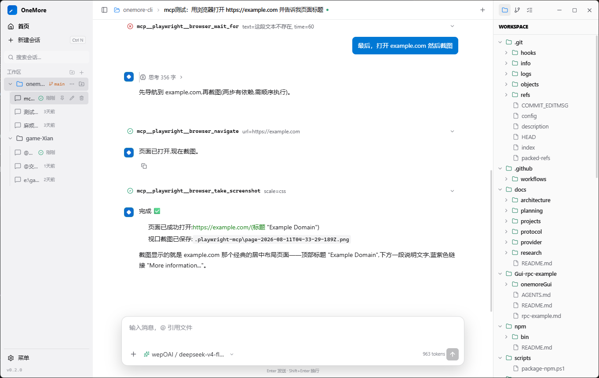

# Onemore

## 文档

- [文档索引](docs/README.md)
- [Runtime 结构与弱 Harness 边界](docs/architecture/runtime-architecture.md)
- [Rust SDK 与 JSONL RPC v3](docs/protocol/rpc-sdk-design.md)
- [Provider 配置与行为](docs/provider/reason-effort.md)
- [当前开发目标](docs/planning/next-phase-goals.md)

Onemore 是从 [Zerone](https://github.com/WEP-56/zerone) 教学基线迁移出的独立 coding agent 工程

## Hi!
onemore对我来说是什么？

我不把它当作一个可以完全信任的企业级的 coding agent，它也没有开源的 Pi、Opencode 一样功能全面。

它是我学习成果、对”弱harness“这一理念的个人理解的象征（关于这点具体请看这篇博客：[Mechanically Strong, Cognitively Weak](https://taoran.weppp.cyou/posts/agent/)）

当然，它完全可以长时间的任务，它的其中一个漂亮的示例是：
[GUI-EXAMPLE](Gui-rpc-example)
+
[sdk](src/sdk)



说实话，虽然公公又式式，但我觉得它挺漂亮！

这是由deepseek v4 flash 0731 在 onemore重实现的。我为它创建了一个分支（现在已经合并了），它持续运行了五个小时，经历了10次自动上下文压缩。完成了完整的rpc-json协议，并制作了那个 tauri+react 的Gui

我只给了deepseek 一个agents.md（让它禁止独立造轮子，写ui、写协议先找源码或skill） 和一句任务 “老哥，帮我给 onemore 加个 rpc-json 协议，写好文档后再做一个漂亮的Gui作为范例，谢了” ，不久后它就完成了。

如果你被某篇文章、评论引来，想要学习、做agent，那我不推荐你看这个仓库。欢迎查看： [Zerone](https://github.com/WEP-56/zerone) 里的文档，顺便再自己实践一下

## 运行

```powershell
cargo run
cargo run -- --once "你好"
cargo run -- --rpc
cargo run -- -p deepseek
```

首次运行会在平台数据目录生成 `config.toml`(Windows 默认 `%APPDATA%\onemore`). 也可以设置 `ONEMORE_HOME` 将配置和会话
放到独立目录:

```powershell
$env:ONEMORE_HOME = "D:\onemore-data"
cargo run
```

配置样例见 `config.example.toml`. 本地 `config.toml` 可能包含 API key,已被 Git 忽略。

## 作为库嵌入

`Agent::new` 保留 CLI 的完整默认装配；宿主也可以从 `Agent::builder` 只替换需要接管的
组件。Provider 使用持久 factory，而不是一次性的实例，因此 `/provider` 和 `/model`
切换后仍会走宿主实现。

```rust
use onemore::config::ProviderSettings;
use onemore::context::ContextProvider;
use onemore::provider::Provider;
use onemore::runtime::{Agent, RetryPolicy};
use onemore::tools::ToolRegistry;
use onemore::workspace::Workspace;

fn embedded_agent(
    settings: ProviderSettings,
    workspace: Workspace,
    provider_factory: impl Fn(ProviderSettings) -> Box<dyn Provider> + Send + Sync + 'static,
    tools: ToolRegistry,
    context: Vec<Box<dyn ContextProvider>>,
) -> anyhow::Result<Agent> {
    Agent::builder_from_provider(settings, workspace)
        .in_memory()
        .provider_factory(provider_factory)
        .tools(tools)
        .context_providers(context)
        .retry_policy(RetryPolicy::default())
        .build()
}
```

`in_memory()` 不创建 SQLite、workspace 偏好或 skills 目录，也不会把 `load_skill` 及其
提示词装进 Agent。宿主还可以分别注入 `ModelRegistry`、`SessionBackend`、
`ModelPreferences` 或冻结的 `SkillCatalog`。

需要完整 stateful harness 的嵌入方通过 `SessionController` 提交命令，并从有界
`SessionEvents` 流消费进度和权威 snapshot。成功返回 `CommandReceipt` 表示 Runtime 已接纳，
最终状态由 `CommandFinished` 报告，`Settled` 总是在相关终态之后：

```rust
use std::time::Duration;

use onemore::runtime::Agent;
use onemore::sdk::{spawn_session, SessionEvent, SessionPhase, SessionSnapshot};

fn run_prompt(agent: Agent) -> Result<SessionSnapshot, Box<dyn std::error::Error>> {
    let mut session = spawn_session(agent);
    let receipt = session.controller.prompt("检查当前项目")?;

    while let Ok(event) = session.events.recv() {
        match event {
            SessionEvent::Progress { progress } => eprintln!("{progress:?}"),
            SessionEvent::CommandFinished { command_id, status, .. }
                if command_id == receipt.command_id =>
            {
                eprintln!("command finished: {status:?}");
            }
            SessionEvent::Settled { .. } => break,
            _ => {}
        }
    }

    let snapshot = session
        .controller
        .wait_until_settled(Duration::from_secs(60))?;
    assert_eq!(snapshot.phase, SessionPhase::Idle);
    let _ = session.controller.shutdown();
    Ok(snapshot)
}
```

## JSONL RPC

`--rpc` 在 stdin/stdout 上提供 UTF-8 JSONL v3。第一帧必须是 hello；stdout 只包含协议帧，
诊断写 stderr。request response 可乱序返回，客户端应使用 request `id` 和 Runtime
`command_id` 关联结果与事件。

```powershell
@(
  '{"type":"hello","version":3}'
  '{"type":"request","id":"snapshot","request":{"command":"get_snapshot"}}'
  '{"type":"request","id":"shutdown","request":{"command":"shutdown"}}'
) | cargo run --quiet -- --rpc
```

帧限制、公开数据白名单、完整命令集和审批示例见
[Rust SDK 与 JSONL RPC v3](docs/protocol/rpc-sdk-design.md)。

一个Tauri Gui参考示例请看：
[Rpc-example](Gui-rpc-example)

不需要 Onemore stateful harness 的宿主可以直接调用同一条生产 core loop：

```rust
use std::sync::atomic::AtomicBool;

use onemore::agent_loop::{
    run_agent_loop, AgentLoopCallbacks, AgentLoopHost, AgentLoopOutcome,
};
use onemore::event::AgentEvent;
use onemore::message::ChatMessage;
use onemore::provider::Provider;
use onemore::tools::ToolSpec;

fn run_core(
    model: &dyn Provider,
    messages: Vec<ChatMessage>,
    tools: &[ToolSpec],
    host: &mut dyn AgentLoopHost,
) -> AgentLoopOutcome {
    let cancel = AtomicBool::new(false);
    let mut emit = |_event: AgentEvent| {};
    run_agent_loop(
        model,
        messages,
        tools,
        AgentLoopCallbacks::new(host, &mut emit, &cancel),
    )
}
```

`AgentLoopHost` callbacks 决定 prompt 变换、工具执行、提交、steering/follow-up 和收尾；
默认 `Agent` adapter 才理解 facts、planning reminder、permissions/hooks 与 session。
compaction 和 session commands 不属于 core loop。具体边界见
[Runtime 结构与弱 Harness 边界](docs/architecture/runtime-architecture.md)。

TUI 内常用操作:

| 操作 | 说明 |
|---|---|
| 运行中输入并回车 | steering:在当前一批工具全部完成并提交后注入,修正方向 |
| `/queue <内容>` | follow-up:排队后续任务,当前任务将停止时才注入，在agent运行中直接发送消息也可以“插嘴” |
| `/compact` | 调用模型生成摘要作为 Compaction 事实;模型视图缩小,事实日志不减少 |
| `Esc` | 取消当前轮(丢弃半截流式输出;未执行的工具调用补取消结果;清空排队输入) |
| `/session [ID\|all]` | 默认列出/恢复当前 workspace 会话；`all` 只做跨 workspace 发现，恢复时重建全部事实(含 UI-only 提示) |
| `/provider` | 只切换 provider，使用其默认模型，历史保留 |
| `/model` | 只列出当前 provider 的模型；选模型后再确认思考程度，可以在配置文件中自定义思考程度名称 |
| `/reasoning` (`/effort`) | 调整当前模型的思考程度 |
| `/reload` | 重新读取配置、`AGENTS.md`、skill catalog、工具声明和 Web binding，并保留当前会话事实 |
| `/clear` | 新建会话 |
| `/tool` | 查看工具详细结果 |
| `Ctrl+T` | 直接呼出/tool面板 |


## 配置

首次运行将在（windows） appdata/romaing/onemore 内生成 config.toml ，更详细的参考请查看：

[config.example.toml](config.example.toml)

## 存储

```text
%APPDATA%/onemore/          # Windows 默认；其他平台使用 XDG 数据目录
  config.toml
  sessions/
    <session-id>.db            # schema v4:事实日志 + 严格计划 reducer + token/cache 用量
  workspaces/
    <workspace-hash>.json      # 仅保存偏离各模型 default_effort 的思考程度
```

技能将使用 codex、claude 等同款的 .agents 文件夹


## npm 包

默认 npm 包名是 `onemore-agent`,安装后命令是 `onemore`:

```powershell
.\scripts\package-npm.ps1 -Pack
npm install --global .\dist\npm\onemore-agent-0.6.0.tgz
onemore --help
```

项目也上传了npm包，但不保证除windows外的可用性
```
npm install -g onemore-agent
```

本地打包只包含当前平台二进制。跨平台组包可通过 `-ArtifactsDir` 提供对应产物。

## 验证

```powershell
cargo fmt --check
cargo test --locked          # 单元测试 + wire 协议测试
cargo build --release --locked
.\scripts\package-npm.ps1 -Pack
```

## License

MIT
